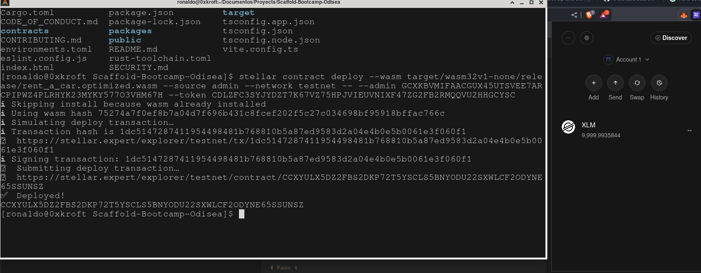
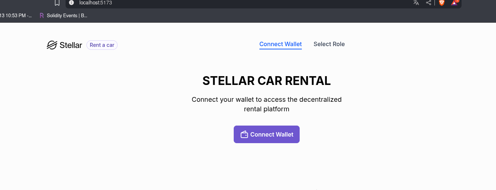
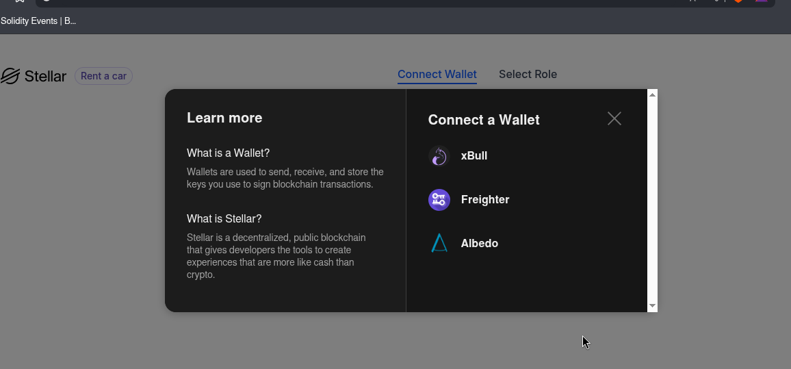
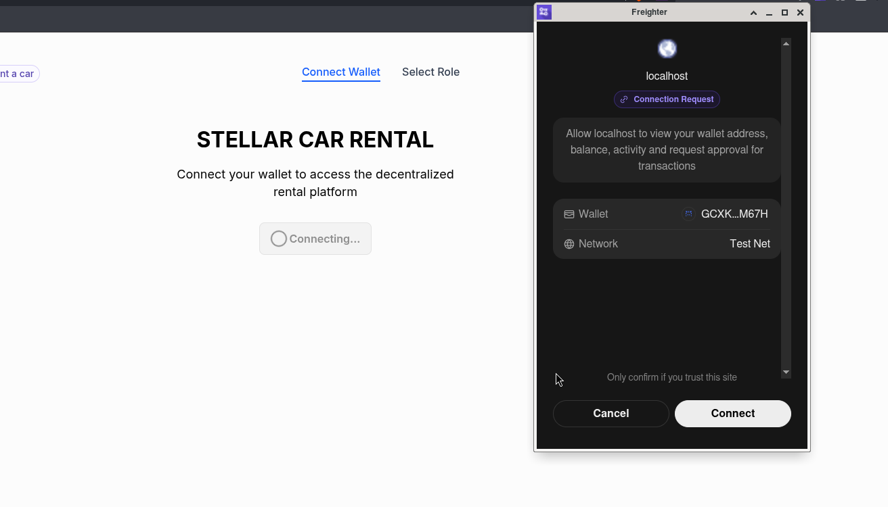
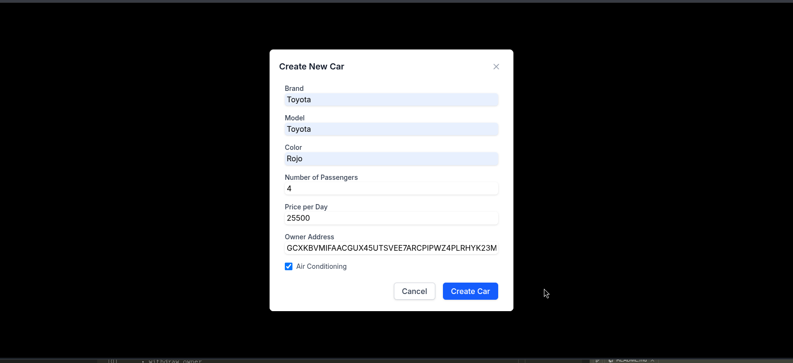

# Rent a Car - Stellar DApp

_Proyecto desarrollado con Scaffold Stellar para gestión descentralizada de alquiler de vehículos._

## 🚗 Descripción del Proyecto

Sistema de alquiler de vehículos implementado en Stellar con smart contracts en Rust y frontend React. El contrato incluye gestión de roles (Admin, Owner, Renter), sistema de comisiones para el administrador, y validaciones de retiro basadas en el estado del vehículo. Los owners pueden registrar sus autos y retirar fondos solo cuando están disponibles, mientras que los renters pueden alquilar vehículos pagando un depósito más la comisión configurada por el admin.

## 📸 Capturas de Pantalla

### Conexión de Wallet



### Selección de Rol



### Vista Admin - Creación de Autos



### Catálogo de Vehículos



### Gestión de Alquileres


### Transacciones en Stellar Expert



---

## 🛠️ Tecnologías Utilizadas

A modern, up-to-date toolkit for building Stellar smart contract frontends.

- ⚡️ Vite + React + TypeScript
- 🔗 Auto-generated contract clients
- 🧩 Example components for contract interaction
- 🛠 Hot reload for contract changes
- 🧪 Easy local/testnet deployment

This is the starter frontend generated by `stellar scaffold init`. See more at [Scaffold Stellar](https://github.com/AhaLabs/scaffold-stellar).

## Requirements

Before getting started, make sure you’ve met the requirements listed in the [Soroban documentation](https://developers.stellar.org/docs/build/smart-contracts/getting-started/setup) and that the following tools are installed :

- [Rust](https://www.rust-lang.org/tools/install)
- [Cargo](https://doc.rust-lang.org/cargo/) (comes with Rust)
- Rust target: install the compilation target listed in the [Soroban setup guide](https://developers.stellar.org/docs/build/smart-contracts/getting-started/setup)
- [Node.js](https://nodejs.org/en/download/package-manager) (v22, or higher)
- [npm](https://www.npmjs.com/): Comes with the node installer or can also be installed package managers such as Homebrew, Chocolatey, apt, etc.
- [Stellar CLI](https://github.com/stellar/stellar-core)
- [Scaffold Stellar CLI Plugin](https://github.com/AhaLabs/scaffold-stellar)

## Quick Start

### 1. Clonar el Repositorio

```bash
git clone <repository-url>
cd Scaffold-Bootcamp-Odisea
```

### 2. Configurar el Entorno

```bash
# Copiar variables de entorno
cp .env.example .env

# Instalar dependencias
npm install

# Instalar target de Rust para WASM
rustup target add wasm32-unknown-unknown
```

### 3. Ejecutar el Proyecto

```bash
# Iniciar servidor de desarrollo (incluye contrato local y frontend)
npm run dev
```

La aplicación estará disponible en `http://localhost:5173`

### 4. Construir el Contrato

```bash
# Compilar el contrato Rust
stellar contract build

# El archivo WASM se genera en: target/wasm32v1-none/release/rent_a_car.wasm
```

## 📋 Funcionalidades Implementadas

### Smart Contract (Rust)

- ✅ Registro de vehículos por owners con precio por día
- ✅ Sistema de alquiler con validación de estado
- ✅ Comisión configurable por el administrador
- ✅ Acumulación automática de comisiones en cada alquiler
- ✅ Retiro de comisiones exclusivo para admin
- ✅ Retiro de fondos para owners solo con auto disponible
- ✅ Función de devolución para cambiar estado del vehículo

### Frontend (React + TypeScript)

- ✅ Integración con Freighter wallet
- ✅ Selección de roles (Admin, Owner, Renter)
- ✅ Interfaz para crear y gestionar vehículos
- ✅ Catálogo de autos con filtrado por estado
- ✅ Botones contextuales según rol del usuario
- ✅ Validación de acciones según estado del vehículo
- ✅ Enlaces a Stellar Expert para verificar transacciones

## 🔧 Estructura del Proyecto

## 🔧 Estructura del Proyecto

```
my-project/                      # Your initialized project
├── contracts/                   # Smart contracts en Rust
│   └── rent-a-car/             # Contrato de alquiler de vehículos
│       ├── src/
│       │   ├── contract.rs     # Implementación del contrato
│       │   ├── interfaces/     # Traits del contrato
│       │   └── storage/        # Gestión de almacenamiento
│       │       ├── admin.rs    # Funciones del administrador
│       │       ├── car.rs      # Gestión de vehículos
│       │       ├── commission.rs # Sistema de comisiones
│       │       └── rental.rs   # Gestión de alquileres
├── src/                         # Frontend React application
│   ├── components/              # Componentes React
│   │   ├── CarList.tsx         # Listado de vehículos
│   │   └── CreateCarForm.tsx   # Formulario de creación
│   ├── interfaces/              # TypeScript interfaces
│   ├── pages/                   # Páginas de la aplicación
│   │   ├── ConnectWallet.tsx   # Conexión wallet
│   │   ├── RoleSelection.tsx   # Selección de rol
│   │   └── Dashboard.tsx       # Panel principal
│   ├── providers/               # Context providers
│   └── services/                # Servicios de integración
│       └── stellar.service.ts  # Cliente Stellar SDK
├── target/                      # Build artifacts and WASM files
├── environments.toml            # Configuración de entornos
└── package.json                 # Frontend dependencies
```

## 🌐 Deploy a Testnet/Mainnet

Para desplegar en testnet o mainnet:

```bash
# Publicar el contrato al registry
stellar registry publish

# Desplegar una instancia con parámetros del constructor
stellar registry deploy \
  --deployed-name rent-a-car \
  --published-name rent-a-car \
  -- \
  --admin <ADMIN_ADDRESS> \
  --token <TOKEN_ADDRESS>

# Crear alias local del contrato desplegado
stellar registry create-alias rent-a-car
```

## 📚 Recursos

- [Stellar Documentation](https://developers.stellar.org/)
- [Soroban Smart Contracts](https://developers.stellar.org/docs/build/smart-contracts)
- [Scaffold Stellar](https://github.com/AhaLabs/scaffold-stellar)

---

**Desarrollado con Scaffold Stellar** 🚀
